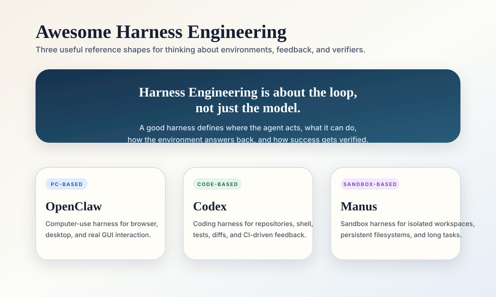
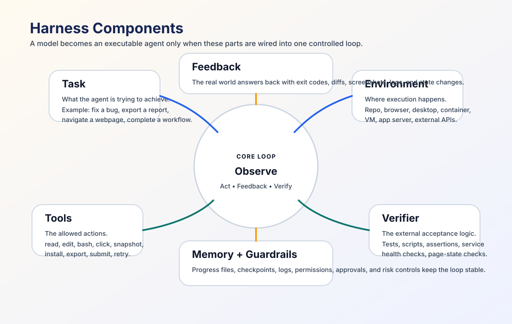
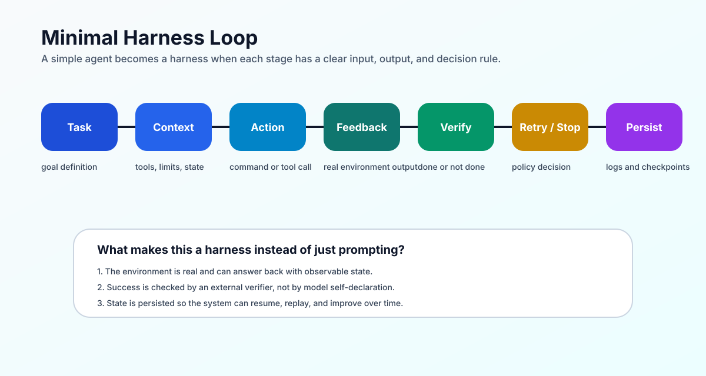
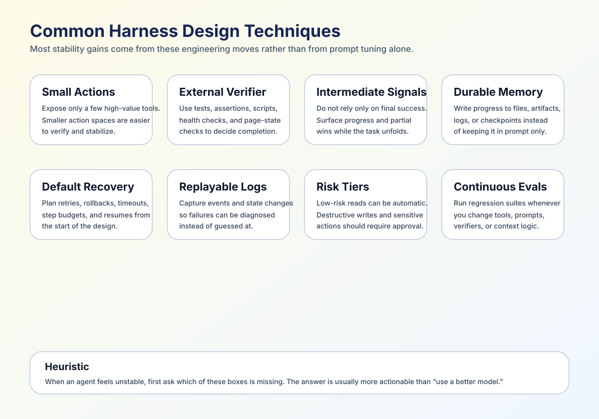
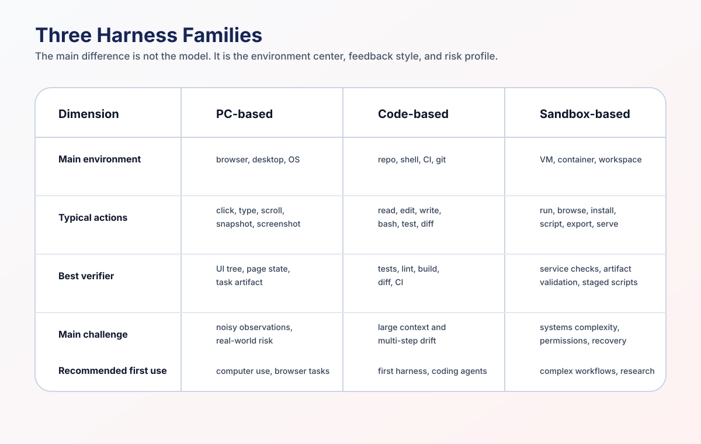
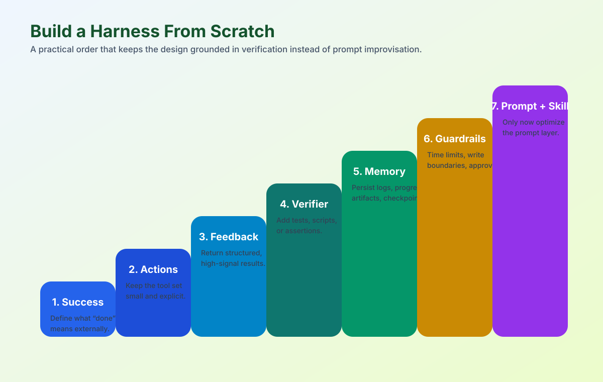
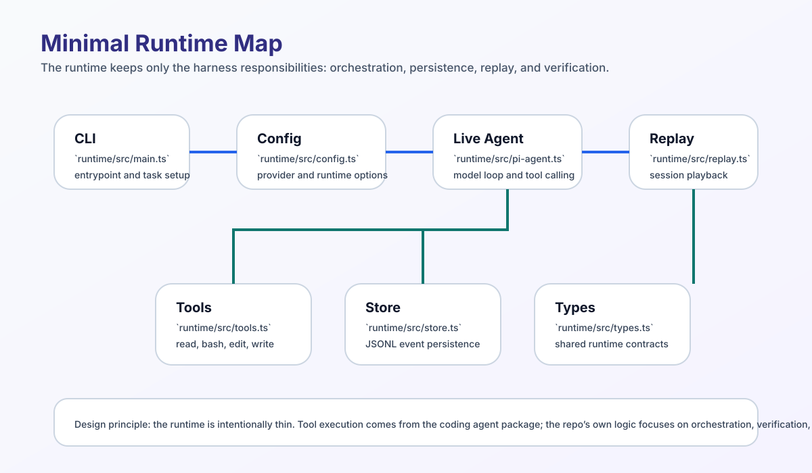

# Awesome Harness Engineering [](https://awesome.re)

English | [中文](./README.md)

A curated list and minimal experiment repo for **Harness Engineering**.

This project is not mainly about “yet another agent framework.” It focuses on:

- how to give agents a more stable execution environment
- how to turn failure into something recoverable, diagnosable, and replayable
- how to use constraints, feedback, logging, and evaluation to make agent execution converge

If you agree with the statement below, this repo is probably for you:

> When agents fail in real environments, the bottleneck is often not model intelligence, but weak harness engineering.



## One sentence for newcomers

`harness = the workbench that lets an agent act, inspect results, and correct itself.`

Without a harness, a model often just “answers.” With a harness, it starts to “execute.”

More concretely, a harness is the system that connects these pieces into a loop:

- `task`: the goal
- `environment`: the real workspace, such as a code repo, browser, computer, or container
- `tools`: the actions the model is allowed to take
- `feedback`: the real result returned by the environment
- `verifier`: external checks for completion and correctness
- `memory`: progress, logs, checkpoints, and durable notes
- `guardrails`: permissions, approvals, and risk controls



## What Harness Means

### What it is not

- not a single prompt
- not just “let the model think longer”
- not merely “connect some tools”
- not purely a model-training problem

### What it is

At its core, a harness is a repeatable closed loop:

`Observe -> Act -> Feedback -> Verify -> Retry/Stop -> Persist`

A simple analogy:

- the LLM is an intern who can reason
- tools are the instruments available to it
- the environment is where it works
- the verifier is the acceptance mechanism
- memory is the work log
- the harness is the system that turns all of that into a stable workflow

## Why Harness Makes Agents Better

In short tasks, prompts and model quality often dominate outcomes. In multi-step tasks and real environments, the main difference usually comes from system design:

- **Reproducibility**: can the same task be run again reliably?
- **Constrained actions**: can the model act only within allowed boundaries?
- **Durable state**: can a run resume after timeout or failure?
- **Useful feedback**: can failures be diagnosed instead of guessed at?
- **Regression discipline**: can you prove the system improved?

You can think of this as a form of “policy improvement without parameter updates.” That is an engineering framing here, not a strict RL term. The main point is that capability gains often come not from updating model weights, but from building a better `action-feedback loop`.

Without a harness, the model is mostly guessing. With a harness, it can:

- inspect the real environment
- take real actions
- receive real feedback
- revise its next step based on that feedback
- carry state into the next turn

## A Minimal Harness Loop

If you want one compact way to explain harnesses, this is the clearest minimal chain:

`Task -> Context -> Action -> Feedback -> Verify -> Retry/Stop -> Persist`



Each stage means:

1. `Task`
   State the goal clearly, for example: “fix the bug and make the tests pass.”
2. `Context`
   Give the agent the repo, tools, constraints, and definition of done.
3. `Action`
   The agent chooses an action, such as reading a file, running tests, clicking a button, or executing a script.
4. `Feedback`
   The environment returns a real result, such as an error, screenshot, DOM snapshot, exit code, or diff.
5. `Verify`
   An external verifier decides whether the task is done, or what is still missing.
6. `Retry/Stop`
   The harness decides whether to continue, retry, roll back, request approval, or stop.
7. `Persist`
   The system writes actions, results, conclusions, and remaining work into logs and state.

A minimal coding example:

- `task`: fix a function
- `action`: read code, run tests, edit files
- `feedback`: test failures
- `verify`: all tests pass
- `persist`: save diffs, logs, and progress notes

Once that chain exists, even with very few tools, you already have a minimal harness.

## Common Harness Design Techniques

This is the most practical checklist in the repo. Many poor agent experiences are not model problems. They are harness problems.



- **Keep the action space small**
  Expose only a few high-value actions. Smaller action spaces are easier to stabilize. In coding, `read / bash / edit / write` is often enough.
- **Externalize success criteria**
  Do not let the model declare success on its own. Use tests, assertions, scripts, page state, or generated artifacts.
- **Provide intermediate feedback**
  Final reward is often too sparse. Intermediate signals like “more tests pass,” “the page reached the target area,” or “the dependency installed” help much more.
- **Write state outside the prompt**
  Use `progress.md`, JSON state, artifacts, checkpoints, and git history so the agent does not lose everything when context resets.
- **Make recovery a default path**
  Timeouts, retries, rollbacks, resume points, and step budgets should be part of the design, not afterthoughts.
- **Log and replay everything**
  Without event logs, traces, or replay, it is hard to understand why the agent failed.
- **Use risk tiers**
  Read-only and analysis actions can be automatic. Destructive writes, login flows, payments, or outbound messages should be isolated or approved.
- **Continuously run evals and regressions**
  A harness is never “finished.” Every change to tools, verifiers, or context assembly can degrade the system.

## Three Common Harness Families

From an engineering perspective, most practical harnesses can be grouped into three broad families:

1. `PC-based harness`
2. `Code-based harness`
3. `Sandbox-based harness`

These are not strict product categories. They are better understood as three different environment centers. Real systems often mix them.



### 1. OpenClaw-style: PC-based Harness

This family uses a real computer or browser as the main environment, with emphasis on GUI interaction, browser state, messaging surfaces, and host capabilities.

**Typical environment**

- local computer
- browser or desktop app
- chat entry points, notifications, files, system permissions

**Typical actions**

- `click`
- `type`
- `scroll`
- `open`
- `screenshot`
- browser snapshot / act

**Typical feedback**

- screenshots
- UI tree / accessibility tree
- page text
- browser state
- external app state

**Why it matters**

It is the closest to real end-user operation, covering web tasks, desktop workflows, messaging, and account-based systems that classic code agents cannot easily reach.

**Why it is hard**

- observations are noisy and GUIs change quickly
- login state, permissions, and anti-bot mechanics are complex
- risky actions are common and can affect real accounts or real systems
- feedback is often sparser than in coding

**Common techniques**

- prefer structured snapshots over screenshots alone
- use dedicated browser or app profiles
- require human approval for high-risk targets
- separate host control, sandbox control, and workspace access
- write memory into the agent workspace instead of stuffing everything into prompts

**Practices worth noticing in OpenClaw**

- the docs define the workspace as the agent’s “home” and place memory on disk as Markdown instead of relying only on context
- sandboxing is Docker-based, with `session / agent / shared` scopes
- browser tooling includes `snapshot`, `screenshot`, and `act`, emphasizing stable UI trees over brittle selectors
- the docs recommend human-assisted login instead of giving raw credentials to the model

References:

- [OpenClaw Docs - Agent workspace](https://docs.openclaw.ai/agent-workspace)
- [OpenClaw Docs - Memory](https://docs.openclaw.ai/concepts/memory)
- [OpenClaw Docs - Sandboxing](https://docs.openclaw.ai/gateway/sandboxing)
- [OpenClaw Docs - Browser](https://docs.openclaw.ai/tools/browser)
- [OpenClaw Docs - Browser Login](https://docs.openclaw.ai/tools/browser-login)
- [OpenClaw Docs - Security](https://docs.openclaw.ai/security)

### 2. Codex / Claude Code-style: Code-based Harness

This family uses the code repository, shell, test system, CI, and git as the main environment. It is currently the most mature and most mechanically verifiable class of harness.

**Typical environment**

- local code repository
- shell
- package manager
- test / build / lint
- git / worktree / CI

**Typical actions**

- `read`
- `edit`
- `write`
- `bash`
- `run test`
- `open PR`

**Typical feedback**

- compiler output
- lint failures
- test results
- diffs
- review comments
- CI status

**Why it matters**

This is the easiest place to build a high-quality harness, because:

- the action space is clear
- the verifier is clear
- the environment is relatively reproducible
- diff, commit history, logs, and CI already exist

**Why it is mature**

In [Harness engineering: leveraging Codex in an agent-first world](https://openai.com/index/harness-engineering), published on February 11, 2026, OpenAI emphasizes making system state legible, editable, and verifiable for the agent rather than chasing “better prompts” in isolation.  
In [Unlocking the Codex harness: how we built the App Server](https://openai.com/index/unlocking-the-codex-harness/), published on February 4, 2026, OpenAI takes that further into protocol, threading, event streams, approvals, and client integration.  
Anthropic’s Claude Code documentation also systematizes memory, hooks, and settings, showing that code-based harnesses are no longer just about “tool calling,” but about how to wire project rules, durable memory, pre-checks, and post-checks into the agent loop.

**Common techniques**

- expose only a few high-value tools
- use tests, lint, and build as the verifier
- use `CLAUDE.md`, `AGENTS.md`, and project docs as durable memory
- use hooks for pre-checks, post-checks, formatting, and sensitive-file protection
- use git diff, commits, and worktrees as recovery and boundary mechanisms
- feed review comments and CI results back into the next run

**Practices worth noticing**

- Codex App Server turns the agent loop into a stable event protocol that IDEs, CLI clients, and web clients can all reuse
- Claude Code memory is hierarchical across project, user, and organization scopes
- Claude Code hooks let external scripts run at `PreToolUse` and `PostToolUse`, pushing constraints outside the prompt

References:

- [OpenAI - Harness engineering: leveraging Codex in an agent-first world](https://openai.com/index/harness-engineering)
- [OpenAI - Unlocking the Codex harness: how we built the App Server](https://openai.com/index/unlocking-the-codex-harness/)
- [Anthropic Docs - Manage Claude's memory](https://docs.anthropic.com/en/docs/claude-code/memory)
- [Anthropic Docs - Claude Code settings](https://docs.anthropic.com/en/docs/claude-code/settings)
- [Anthropic Docs - Hooks reference](https://docs.anthropic.com/en/docs/claude-code/hooks)
- [Anthropic - Effective context engineering for AI agents](https://www.anthropic.com/engineering/effective-context-engineering-for-ai-agents/)
- [Anthropic - Effective harnesses for long-running agents](https://www.anthropic.com/engineering/effective-harnesses-for-long-running-agents)

### 3. Manus-style: Sandbox-based Harness

This family uses a controlled sandbox, container, VM, or isolated workspace as the main environment, with emphasis on isolation, multi-tool orchestration, and autonomous multi-step execution.

**Typical environment**

- cloud VM
- container
- isolated workspace
- persistent filesystem
- controlled network access

**Typical actions**

- file operations
- shell execution
- browser actions
- software installation
- script execution
- artifact generation

**Typical feedback**

- command output
- generated artifacts
- browser results
- service state
- phase or task state

**Why it matters**

When the task is more than “edit code” or “click through a webpage,” and instead spans browsers, scripts, files, services, and data work, sandbox-based harnesses become more general.

**Why it is hard**

- it must balance openness and safety
- the combination of tools and environments is broader
- external dependencies are heavier, runs are longer, and recovery is more complex

**Common techniques**

- use VMs or containers for strong isolation
- use allowlists for network, files, and external services
- use artifact directories and persistent filesystems as state bridges
- use multi-stage verifiers for completion
- use progressive loading or skill loading to control context size

**Practices worth noticing in Manus**

- the docs describe it as a “full sandbox environment” with a virtual computer, persistent filesystem, internet access, software installation, and custom tools
- Agent Skills package `SKILL.md + scripts + resources` into reusable workflows
- the skills design explicitly emphasizes progressive disclosure: load instructions and resources only when needed, rather than front-loading everything into context

References:

- [Manus Docs - Welcome](https://manus.im/docs/en/introduction/welcome)
- [Manus - Agent Skills](https://manus.im/features/agent-skills)

## Comparing the Three Families

| Type | Main environment | Typical actions | Typical verifier | Strengths | Main challenges |
| --- | --- | --- | --- | --- | --- |
| `PC-based` | real computer, browser, desktop apps | click / type / snapshot / screenshot | page state, screenshot, UI tree, task artifact | closest to real user tasks | noisy observations, higher risk, sparse feedback |
| `Code-based` | code repo, shell, CI, git | read / edit / write / bash / test | tests, lint, build, diff, CI | clearest feedback and easiest regression control | large-repo context and multi-step drift |
| `Sandbox-based` | container, VM, isolated workspace | shell, browser, file, script, service | staged scripts, service checks, artifact validation | most general for complex workflows | harder systems design, permissions, and recovery |

A practical rule of thumb:

- if this is your first harness, start with `code-based`
- if you care about computer use, browser workflows, or messaging agents, focus on `PC-based`
- if you care about complex workflows, research tasks, data work, or cross-tool execution, focus on `sandbox-based`

## How To Build a Simple Harness From Scratch

If you want to start building today, use this order:



### 1. Define success first

Answer “how will we know the task is done?” before you write prompts.

Examples:

- tests pass
- the page reaches a target state
- a required file is generated
- a report is exported
- a health check passes

### 2. Define the smallest useful action space

Do not expose too many actions. Start with three to five critical ones.

Examples:

- coding: `read / bash / edit / write`
- browser: `open / snapshot / act / screenshot`
- sandbox: `run / write / browse / export`

### 3. Design feedback for every action

Every action should return real, structured, high-signal feedback when possible.

Examples:

- exit code
- stderr
- DOM snapshot
- file diff
- JSON result

### 4. Add an external verifier

Do not let the model judge completion by itself. The verifier should be as mechanical and scriptable as possible.

### 5. Add memory and persistence

At minimum, keep:

- event logs
- a progress file
- artifacts
- checkpoints or resumable state

### 6. Add guardrails

At minimum, add:

- step budgets
- timeouts
- write boundaries
- approvals for high-risk actions

### 7. Only then optimize prompt and skills

Prompts matter, but they should not replace environment design, feedback design, or verification design.  
Skills matter because they package stable workflows, not because they magically add capability by themselves.

## What This Repository Includes

This repository currently has two parts:

### 1. An awesome list

It collects high-value tools, frameworks, papers, and references for the main layers of harness engineering, especially:

- execution environments
- constraints and guardrails
- state, checkpoints, and recovery
- observability
- evaluation, regression, and safety testing

### 2. A minimal local runtime experiment

The `runtime/` directory is not a complete product. It is a deliberately small reference implementation that demonstrates the most basic loop:

`task -> action -> feedback -> decision -> persistence`

The current runtime is a minimal TypeScript version that keeps only the core responsibilities of the harness:

- JSON config loading
- JSONL event logging
- replay
- verifier / done-check
- CLI orchestration

It exposes only four tools to the model:

- `read`
- `bash`
- `edit`
- `write`

If you are building your own agent runtime, this is meant to be a small but complete starting point.

## Repository Structure

```text
.
├── README.md
├── README_EN.md
├── agent.md
├── research/
│   ├── official-sources.json
│   └── source-snapshots.json
├── runtime/
│   ├── README.md
│   ├── config.example.json
│   ├── example_plan.jsonl
│   ├── fixtures/
│   │   └── replay-session.jsonl
│   └── src/
│       ├── config.ts
│       ├── main.ts
│       ├── pi-agent.ts
│       ├── replay.ts
│       ├── store.ts
│       ├── tools.ts
│       └── types.ts
├── scripts/
└── tests/
```

## Minimal Runtime

`runtime/` currently provides a **local, replayable, minimal-tool runtime** suitable for concept demos and teaching.



### Implemented capabilities

- **Two run modes**
  - live: generate the next action through an OpenAI-compatible provider
  - replay: replay a recorded JSONL session
- **Four built-in tools**
  - `read`
  - `bash`
  - `edit`
  - `write`
- **Minimal policy loop**
  - supports `done-check`
  - supports `maxSteps`
  - supports JSONL event persistence
- **Persistent logs**
  - each step is written to `.runs/*.jsonl`
  - useful for replay, debugging, and later analysis

### What it intentionally does not do

To stay small, it does not currently cover:

- multi-agent collaboration
- concurrent scheduling
- distributed queues
- complex permission systems
- advanced recovery strategies
- a large tool ecosystem

That is intentional. The goal of this directory is:
**to explain the key structure of a harness with as little code as possible.**

### Quick start

Install dependencies first:

```bash
npm install
```

#### 1. Replay mode

```bash
npm run dev -- --replay-file runtime/fixtures/replay-session.jsonl
```

#### 2. Live mode

Copy the config first:

```bash
cp runtime/config.example.json runtime/config.json
```

Then fill in your model configuration and run:

```bash
node --import tsx runtime/src/main.ts \
  --task "Use the bash tool to run 'python3 -V'. Then report the Python version in one sentence." \
  --workspace . \
  --config runtime/config.json \
  --done-check "python3 -V"
```

See `runtime/README.md` for more complete usage details.

## Table of Contents

- [Foundations](#foundations)
- [Typical Harness References](#typical-harness-references)
- [Execution Environments](#execution-environments)
- [Constraints and Guardrails](#constraints-and-guardrails)
- [State, Checkpoints, and Recovery](#state-checkpoints-and-recovery)
- [App Legibility and Observability](#app-legibility-and-observability)
- [Evaluation and Regression Loops](#evaluation-and-regression-loops)
- [Safety and Misuse Testing](#safety-and-misuse-testing)
- [Continuous Cleanup and Anti-Drift](#continuous-cleanup-and-anti-drift)
- [Contributing](#contributing)

## Foundations

These entries help establish the core language of the field: what a harness is, why agent-first systems need it, and how to turn trial-and-error into structured iteration.

- [OpenAI - Harness engineering: leveraging Codex in an agent-first world](https://openai.com/index/harness-engineering/) - 2026-02-11. Agent-first engineering framing. Why: helps shift thinking from “using a model” to “designing a system.”
- [OpenAI - Unlocking the Codex harness: how we built the App Server](https://openai.com/index/unlocking-the-codex-harness/) - 2026-02-04. The protocol and client layer behind the Codex harness. Why: breaks the agent loop down into threads, events, and integration surfaces.
- [OpenAI - From model to agent: Equipping the Responses API with a computer environment](https://openai.com/index/equip-responses-api-computer-environment) - 2026-03-11. Computer-environment integration. Why: shows how to connect a computer environment to the agent loop.
- [Anthropic - Effective context engineering for AI agents](https://www.anthropic.com/engineering/effective-context-engineering-for-ai-agents/) - 2025-09-29. Context-engineering methods. Why: helps control context size and information loading for multi-step tasks.
- [Anthropic - Effective harnesses for long-running agents](https://www.anthropic.com/engineering/effective-harnesses-for-long-running-agents) - 2025-11-26. Multi-step coding-harness practice. Why: shows initializer flows, progress files, and single-feature session design.
- [Anthropic - Demystifying evals for AI agents](https://www.anthropic.com/engineering/demystifying-evals-for-ai-agents) - 2026-01-09. Evaluation methods. Why: turns “is this good?” into a continuous verification problem.
- [openai/evals](https://github.com/openai/evals) - Reproducible model-evaluation framework. Why: builds a baseline feedback loop and comparison point.
- [Promptfoo](https://github.com/promptfoo/promptfoo) - Assertions, regression tests, and red-team checks. Why: brings prompt and agent behavior into CI.

## Typical Harness References

These entries are useful when you want to understand why harness priorities differ across environment types.

- [OpenClaw Docs - Agent workspace](https://docs.openclaw.ai/agent-workspace) - Workspace design in a PC-based environment. Why: makes the agent’s working directory, memory, and isolation boundaries explicit.
- [OpenClaw Docs - Memory](https://docs.openclaw.ai/concepts/memory) - File-based durable memory. Why: shows that memory should live in the environment, not only in the context window.
- [OpenClaw Docs - Sandboxing](https://docs.openclaw.ai/gateway/sandboxing) - Docker-based isolation strategy. Why: shows `session / agent / shared` isolation layers.
- [OpenClaw Docs - Browser](https://docs.openclaw.ai/tools/browser) - Browser snapshot / screenshot / act tooling. Why: shows how PC-based harnesses structure GUI interaction.
- [OpenClaw Docs - Security](https://docs.openclaw.ai/security) - Browser and host-control risks. Why: highlights permissions and isolation in computer-use systems.
- [Anthropic Docs - Manage Claude's memory](https://docs.anthropic.com/en/docs/claude-code/memory) - Code-based memory system. Why: shows how project-, user-, and org-level memory can be layered.
- [Anthropic Docs - Hooks reference](https://docs.anthropic.com/en/docs/claude-code/hooks) - Code-based pre- and post-checks. Why: shows how external scripts can be attached to the agent loop.
- [Anthropic Docs - Claude Code settings](https://docs.anthropic.com/en/docs/claude-code/settings) - Permissions and tool configuration. Why: shows how code-based harnesses share rules.
- [Manus Docs - Welcome](https://manus.im/docs/en/introduction/welcome) - Overview of a sandbox-based system. Why: explains the “virtual computer + persistent filesystem + network + software install” setup.
- [Manus - Agent Skills](https://manus.im/features/agent-skills) - Skill packaging and progressive loading. Why: shows how sandbox-based harnesses package workflows into reusable capabilities.

## Execution Environments

This layer answers where agents run, how they run, and what happens when execution fails or needs to resume. Without a stable environment, even a good strategy is hard to reproduce.

- [Docker](https://www.docker.com/) - Reproducible runtime packaging. Why: reduces failures caused by environment drift.
- [Kubernetes](https://kubernetes.io/) - Isolation and lifecycle management. Why: supports durable execution and resource control.
- [Temporal](https://temporal.io/) - Durable workflow orchestration. Why: built-in retries, timeouts, and resume semantics.
- [LangGraph](https://github.com/langchain-ai/langgraph) - Stateful multi-step agent runtime. Why: makes multi-step flows explicit instead of hiding them in prompts.
- [GitHub Actions](https://docs.github.com/actions) - Automation substrate. Why: makes run / validate / regression loops easier to integrate into existing engineering workflows.

## Constraints and Guardrails

Without boundaries, one bad action can cascade. Guardrails keep the system understandable, safe, and reversible.

- [AGENTS.md](https://agents.md/) - Repository-level operating instructions for agents. Why: makes behavioral boundaries explicit.
- [ESLint](https://eslint.org/) - Static quality and pattern checks. Why: reduces generated-code drift from team conventions.
- [Semgrep](https://semgrep.dev/) - Custom policy rules. Why: enforces security and architectural invariants mechanically.
- [dependency-cruiser](https://github.com/sverweij/dependency-cruiser) - Dependency boundary checks. Why: protects layering and dependency direction.
- [Zod](https://github.com/colinhacks/zod) - Runtime schema validation. Why: stops bad data from spreading across tool boundaries.

## State, Checkpoints, and Recovery

Multi-step tasks will eventually hit interruption, timeout, or flaky dependencies. The key question is not whether failure happens, but whether recovery is cheap.

- [PostgreSQL](https://www.postgresql.org/) - Durable task-state storage. Why: reliable progress tracking and recovery points.
- [Redis](https://redis.io/) - Queues, locks, and ephemeral state. Why: efficient coordination and fault tolerance.
- [Celery](https://github.com/celery/celery) - Distributed task retry framework. Why: mature recovery for async execution.
- [BullMQ](https://github.com/taskforcesh/bullmq) - JS/TS job queues with retries. Why: job-level recovery in the Node ecosystem.
- [Backoff](https://github.com/litl/backoff) - Retry/backoff primitives. Why: improves resilience against flaky external systems.

## App Legibility and Observability

Agent failure is manageable when it is visible. Observability is what turns opaque runs into maintainable systems.

- [Chrome DevTools Protocol](https://chromedevtools.github.io/devtools-protocol/) - Programmatic browser introspection. Why: makes UI state and network behavior visible.
- [Playwright](https://playwright.dev/) - Deterministic browser automation and traces. Why: reproducible UI validation paths.
- [OpenTelemetry](https://opentelemetry.io/) - Unified traces, metrics, and logs. Why: root-cause analysis across components.
- [Prometheus](https://prometheus.io/) - Metrics and SLO checks. Why: makes runtime quality measurable.
- [Grafana Loki](https://grafana.com/oss/loki/) - Log aggregation and querying. Why: structured failure triage.
- [Grafana Tempo](https://grafana.com/oss/tempo/) - Trace-level debugging. Why: better diagnosis of cross-service failures.

## Evaluation and Regression Loops

A harness is never “finished.” You need to keep proving that changes did not make the system worse.

- [pytest](https://docs.pytest.org/) - Smoke and regression execution layer. Why: fast test orchestration.
- [pytest-benchmark](https://github.com/ionelmc/pytest-benchmark) - Performance regression checks. Why: protects latency budgets.
- [LangSmith Evaluations](https://docs.smith.langchain.com/evaluation) - Dataset + run + evaluator pipeline. Why: standardizes eval operations.
- [DeepEval](https://github.com/confident-ai/deepeval) - LLM test-case abstractions. Why: reusable quality assertions and test patterns.
- [RAGAS](https://github.com/explodinggradients/ragas) - Retrieval quality metrics. Why: more objective feedback for RAG systems.

## Safety and Misuse Testing

Once an agent can access the filesystem, browser, shell, or external APIs, safety becomes an execution problem, not just a language problem.

- [PyRIT](https://github.com/Azure/PyRIT) - Generative AI red-team toolkit. Why: structured offensive testing workflows.
- [Garak](https://github.com/NVIDIA/garak) - Probe-based vulnerability scanner. Why: broad misuse-surface coverage.
- [SafeArena (paper)](https://arxiv.org/abs/2503.04957) - Harmfulness benchmark for web agents. Why: concrete risky-task coverage.
- [OS-Harm (paper)](https://arxiv.org/abs/2506.14866) - OS-level harm benchmark. Why: validates computer-use risks.
- [CUAHarm (paper)](https://arxiv.org/abs/2508.00935) - Harmful task execution benchmark. Why: measures execution-level safety boundaries.

## Continuous Cleanup and Anti-Drift

Agent systems drift as prompts, tools, models, and dependencies change. This layer is about staying healthy over time.

- [Renovate](https://github.com/renovatebot/renovate) - Automated dependency updates. Why: reduces maintenance entropy.
- [Ruff](https://github.com/astral-sh/ruff) - Fast Python lint / format. Why: low-cost continuous cleanup.
- [Biome](https://github.com/biomejs/biome) - JS/TS formatter + linter. Why: keeps generated code more consistent.
- [SonarQube](https://www.sonarsource.com/products/sonarqube/) - Long-term quality trend tracking. Why: surfaces structural regression earlier.

## Contributing

PRs are welcome for high-quality additions, wording improvements, or small runtime refinements.

Suggested entry format:

```text
- [Name](link) - short description. Why: how it helps harness engineering.
```

Before submitting, please check:

- the entry is directly relevant to harness engineering
- the source is preferably official or primary
- it is not a duplicate of an existing entry
- the wording is concise, concrete, and non-marketing
- the value to agent harnesses is made explicit

If you are unsure where an entry belongs, describe the problem it solves in the PR and it will be easier to categorize.
